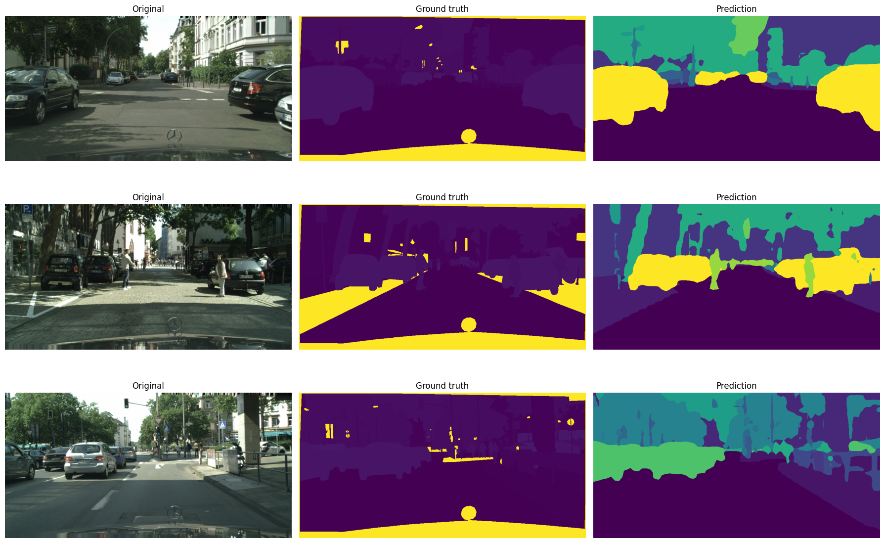
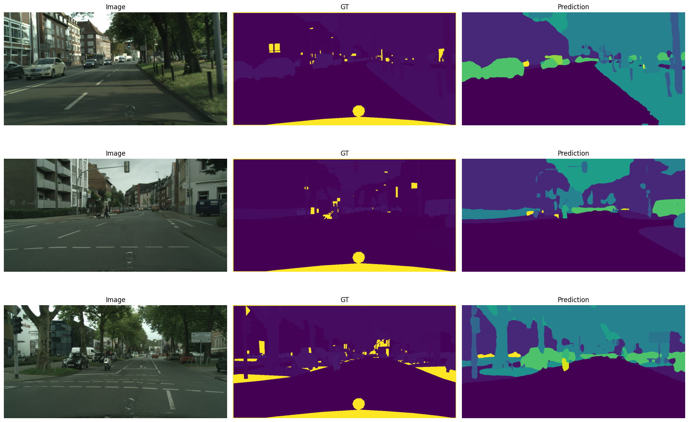

# Разработка системы семантической сегментации дорожной сцены

Материалы курсовой работы по повышению устойчивости семантической сегментации дорожных сцен в сложных погодных условиях и при пониженной видимости. Основной сценарий исследования: обучение на `Cityscapes` и оценка переноса на `ACDC`, с отдельным блоком `UDA-lite`, где в обучение добавляются неразмеченные данные целевого домена.

## О проекте

Цель работы: исследовать, как разные стратегии обучения влияют на качество сегментации в условиях `fog`, `night`, `rain`, `snow`, с отдельным вниманием к слабоконтрастным объектам.

В работе рассматриваются:
- базовые модели `DeepLabV3+`, `InternImage-Tiny`, `SegFormer-B2`, `DINOv2-Small`;
- source-only / DG-подходы `E0-E4`;
- UDA-lite эксперименты `U1-U2` для `DINOv2-Small`;
- единый контур оценки на `ACDC validation`.

С точки зрения внешнего контекста задача соотносится с публичным benchmark `Cityscapes -> ACDC`, где доминируют полноценные `UDA`-методы. В репозитории же основной акцент сделан на воспроизводимом учебно-исследовательском пайплайне и на сравнении реалистичных улучшений внутри одного проекта. Benchmark: [HyperAI, Domain Adaptation on Cityscapes to ACDC](https://hyper.ai/en/sota/tasks/domain-adaptation/benchmark/domain-adaptation-on-cityscapes-to-acdc).

## Структура репозитория

```text
.
├── data/                             # локальные данные, в репозитории не хранятся
├── notebooks/
│   ├── train/
│   │   ├── cityscapes/
│   │   │   ├── e0/                   # baseline-обучение
│   │   │   ├── e1/                   # low-contrast/weather augmentations
│   │   │   ├── e2/                   # class-balanced / focal loss
│   │   │   ├── e3/                   # frequency-style augmentation
│   │   │   └── e4/                   # source consistency regularization
│   │   └── cityscapes_acdc/
│   │       ├── u1/                   # pseudo-label self-training
│   │       └── u2/                   # online EMA teacher + ClassMix
│   ├── pseudo/
│   │   └── acdc/u1/                  # генерация pseudo-labels на ACDC train
│   └── eval/
│       ├── acdc/
│       │   ├── e0-e4/                # оценка source-only экспериментов
│       │   ├── u1/                   # оценка U1
│       │   └── u2/                   # оценка U2
│       └── ACDC_Eval_Metrics_Comparison.ipynb
├── weights/                          # чекпоинты моделей, в репозитории не хранятся
├── main.tex                          # основной текст курсовой
├── main.pdf                          # собранная версия работы
├── references.bib                    # библиография
└── README.MD
```

## Логика экспериментов

### Блок A. Source-only / DG-style

- `E0`: базовое обучение на `Cityscapes` без специальных приёмов domain robustness.
- `E1`: добавление аугментаций, имитирующих ухудшение контраста, освещения и погоды.
- `E2`: усиление функции потерь через `class-balanced` веса и `focal`-компоненту.
- `E3`: частотная аугментация в духе `FDA`, но без использования `ACDC` в обучении.
- `E4`: consistency regularization на source-домене через weak/strong views.

### Блок B. UDA-lite

- `U1`: генерация pseudo-labels на `ACDC train` лучшей source-only моделью и последующее дообучение на смеси `Cityscapes + ACDC pseudo-labels`.
- `U2`: онлайн-обучение со схемой `EMA teacher + ClassMix`, где pseudo-labels генерируются внутри тренировочного цикла, а не заранее.

## Ключевые результаты

Ниже приведены основные результаты для линии `DINOv2-Small` на `ACDC validation`:

| Этап | Overall mIoU | Fog | Night | Rain | Snow |
| --- | ---: | ---: | ---: | ---: | ---: |
| `E0` | `0.5436` | `0.6882` | `0.3350` | `0.5263` | `0.5816` |
| `E1` | `0.5620` | `0.6940` | `0.3506` | `0.5540` | `0.5963` |
| `E2` | `0.5609` | `0.6810` | `0.3510` | `0.5507` | `0.5977` |
| `E3` | `0.5711` | `0.6977` | `0.3823` | `0.5542` | `0.6004` |
| `E4` | `0.5622` | `0.6879` | `0.3605` | `0.5635` | `0.5836` |
| `U1` | `0.5828` | `0.7001` | `0.3887` | `0.5898` | `0.5977` |
| `U2` | `0.5957` | `0.7055` | `0.3980` | `0.6058` | `0.6087` |

Лучший итоговый результат в текущей публичной версии репозитория показывает `DINOv2-Small U2`.

Для линии `SegFormer-B2` лучший результат на `ACDC validation` получен на этапе `E3`:

| Модель | Лучший этап | Overall mIoU |
| --- | --- | ---: |
| `DINOv2-Small` | `U2` | `0.5957` |
| `SegFormer-B2` | `E3` | `0.5023` |
| `InternImage-Tiny` | `E0` | `0.3899` |
| `DeepLabV3+` | `E0` | `0.3015` |

## Примеры сегментации

Ниже приведены сохранённые визуализации из train-ноутбуков `DINOv2-Small`. Во всех примерах колонки идут слева направо: `Image`, `GT`, `Prediction`.

### `E3`: лучший source-only этап

Источник: `notebooks/train/cityscapes/e3/DinoV2_E3_Cityscapes_FrequencyStyleAug.ipynb`



### `U1`: self-training на pseudo-labels

Источник: `notebooks/train/cityscapes_acdc/u1/DinoV2_U1_Cityscapes_ACDC_PseudoLabelSelfTraining.ipynb`



## Основные выводы

- На baseline-этапе `DINOv2-Small` оказался сильнейшей моделью для кросс-доменной оценки на `ACDC`.
- Среди source-only улучшений наиболее полезным оказался этап `E3` с частотной аугментацией.
- Этап `E4` не дал устойчивого прироста и в финальную практическую линию не вошёл.
- Переход к `UDA-lite` действительно дал дополнительный выигрыш: `U1` улучшил качество относительно `E3`, а `U2` стал лучшим итоговым запуском.
- Самым сложным поддоменом на всём протяжении экспериментов остаётся `night`, что согласуется с формулировкой задачи про слабоконтрастные объекты.

## Что рекомендуется смотреть в репозитории

- `notebooks/eval/ACDC_Eval_Metrics_Comparison.ipynb` — сводная таблица всех метрик.
- `notebooks/train/cityscapes/e3/` — лучший source-only этап.
- `notebooks/train/cityscapes_acdc/u2/` — финальный лучший UDA-lite вариант.
- `main.tex` / `main.pdf` — текст курсовой работы.

## Источники и контекст

Публичный benchmark:
- [HyperAI: Domain Adaptation on Cityscapes to ACDC](https://hyper.ai/en/sota/tasks/domain-adaptation/benchmark/domain-adaptation-on-cityscapes-to-acdc)

Ключевые работы, на которые опирается проект:
- [ACDC: The Adverse Conditions Dataset with Correspondences for Robust Semantic Driving Scene Perception](https://arxiv.org/abs/2104.13395)
- [DINOv2: Learning Robust Visual Features without Supervision](https://arxiv.org/abs/2304.07193)
- [SegFormer: Simple and Efficient Design for Semantic Segmentation with Transformers](https://proceedings.neurips.cc/paper_files/paper/2021/file/64f1f27bf1b4ec22924fd0acb550c235-Paper.pdf)
- [DeepLabV3+: Encoder-Decoder with Atrous Separable Convolution for Semantic Image Segmentation](https://arxiv.org/abs/1802.02611)
- [InternImage: Exploring Large-Scale Vision Foundation Models with Deformable Convolutions](https://openaccess.thecvf.com/content/CVPR2023/papers/Wang_InternImage_Exploring_Large-Scale_Vision_Foundation_Models_With_Deformable_Convolutions_CVPR_2023_paper.pdf)
- [FDA: Fourier Domain Adaptation for Semantic Segmentation](https://openaccess.thecvf.com/content_CVPR_2020/html/Yang_FDA_Fourier_Domain_Adaptation_for_Semantic_Segmentation_CVPR_2020_paper.html)
- [DAFormer: Improving Network Architectures and Training Strategies for Domain-Adaptive Semantic Segmentation](http://openaccess.thecvf.com/content/CVPR2022/html/Hoyer_DAFormer_Improving_Network_Architectures_and_Training_Strategies_for_Domain-Adaptive_Semantic_CVPR_2022_paper.html)

## Замечание по данным и весам

later...
